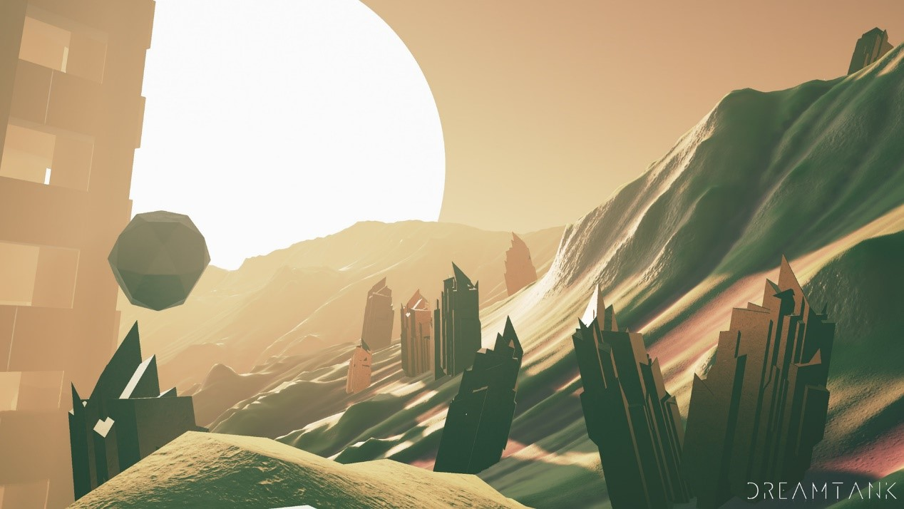
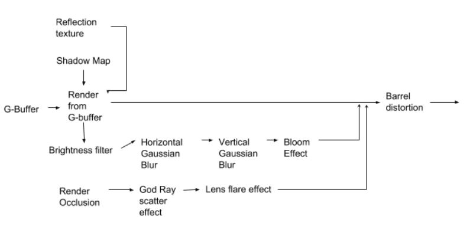

# CIS-566 Procedural Graphics Final Project

## Group Member: 
- Hanming Zhang
- Linshen Xiao

## Demo

Since the whole demo scene is procedurally generated, **please wait for around 30s everytime your load it. If your browse pop up "not response" window, please click "wait".**

**Please remeber to press the "DemoMode" button!**

- [Online Demo Link](https://hanmingzhang.github.io/homework-final/)

## Overview

### Motivation

We would like to create an animated environment with interactive procedural animations and models. We are motivated by games like Jounery and DreamTank. 

### Goal

The goal of this project is to create an environment that feels responsive and alive.

### Inspiration

|DreamTank|Jounery|Unlimited Blade Works|
|--------------|--------------|--------------|
||||

### More Screenshots

### What we have done

**Hanming Zhang**
	
- Sky box
- ShadowMap
- Cinematic Camera(with fade in/out transition effect)
- Water
- God ray
- Bloom
- Deferred Shading Pipeline
- Particle System
- Background Music

**Linshen Xiao**

- Terrain
- Fog
- Desert shader
	- Desert material
	- Cloud shadow
- Scattering objects
- Ribbon shader
	- Flowing effect
- Cloud and Star
- Curl noise for particles
- Postprocessing
	- Chromatic Aberration
	- Vignette
	- FilmNoise
	- Flare
- Final Color Grading

### Technique

**Hanming Zhang**

- **Sky box**:
	We use a Cubic sky box in our scene and the sky itself is procedurally generated in shader.
- **ShadowMap**:
	Here is a screenshot of shadow:
	

	Shadow map is pre-baked when our scene is initialized so that we can save some time when render a frame. For some implemetation details, I refer to [WebGL Tutorial: Directional Shadow Mapping without extensions](http://www.chinedufn.com/webgl-shadow-mapping-tutorial/).
- **Cinematic Camera**:
	It's basically a time-driven key-frame simple system. In the scene initialization stage, we set several key-frames, and linear lerp camera's position and target position. Also, during the transition, we use some fade in/out post processing effect to make it more cinematic
- **Water**:
	An independent pass is used to render a reflection frame. We save it in our frame buffer and use it as a texture in the following water rendering pass. Here is the pure refection effects and water we got:

| | |
|-----------------|-----------------|
|pure reflection  | water with reflection|

- **God ray**
- **Bloom**
- **Deferred Shading Pipeline**:
	Here is a basic view of our pipeline:
	
- **Particle System**:
	Basic we use particles(0.1 million) to simulate sands effect on the terrain surface. Here is a screen shot of only particles:
	
- **Audio**

**Linshen Xiao**

- **Terrain**: Modified Fractal Brownian Motion from [here](https://thebookofshaders.com/13/)
- **Fog**: Mix Fog's Color based on depth of fragments;
- **Desert Shader**:
	- **Desert material**: Modified from [The shading of Dunes in Journey](https://zhuanlan.zhihu.com/p/33890890) (in Chinese);
		- Oren Nayer Diffuse;
		- Direction of normal map decided by the direction of normals, steep and shallow based on the slope of surface;
		
		- Specular map flowing direction decided by the direction of normals;
	- **Cloud Shadow**:
		- Modified Fractal Brownian Motion from [here](https://thebookofshaders.com/13/);
		- Calculate the value from the function above based on the world position and pass it to fragment shader for further computation of final color;
- **Scattering Objects**: Scatter the swords and the monuments by randomly choosing a index of the terrain, rotate the objects based on the normal of that vertex on the terrain;
- **Ribbon shader**:
	- Windy effect: Use sin function to offset the vertices based on time and world position;
- **Cloud and Star**
	- Modified Fractal Brownian Motion from [here](https://thebookofshaders.com/13/), offset the position during the loop of octaves by time to achieve the transformation of clouds;
- **Curl noise for particles**
	- Curl noise modified from [here](http://petewerner.blogspot.com/2015/02/intro-to-curl-noise.html). 2D Noise is still Modified Fractal Brownian Motion from [here](https://thebookofshaders.com/13/) ;
- **Postprocessing**
	- Chromatic Aberration: Modified from [here](https://www.shadertoy.com/view/4ttXWM);
	- Vignette: Modified from [here](https://www.shadertoy.com/view/lsKSWR);
	- FilmNoise: Modified from [here](https://www.shadertoy.com/view/4sXSWs);
	- Flare: Modified from [here](https://www.shadertoy.com/view/4sX3Rs);
- **Final Color Grading**: Light color, fog color changed when the inclination of the skybox changed;

### Bloop
 

## Resources

- [Fractal Brownian Motion](https://thebookofshaders.com/13/)
- [The shading of Dunes in Journey](https://zhuanlan.zhihu.com/p/33890890)
- [Curl Noise](http://petewerner.blogspot.com/2015/02/intro-to-curl-noise.html)
- [Chromatic Aberration](https://www.shadertoy.com/view/4ttXWM)
- [Vignette](https://www.shadertoy.com/view/lsKSWR)
- [FilmNoise](https://www.shadertoy.com/view/4sXSWs)
- [Flare](https://www.shadertoy.com/view/4sX3Rs)
- [WebGL Tutorial: Directional Shadow Mapping without extensions](http://www.chinedufn.com/webgl-shadow-mapping-tutorial/)

